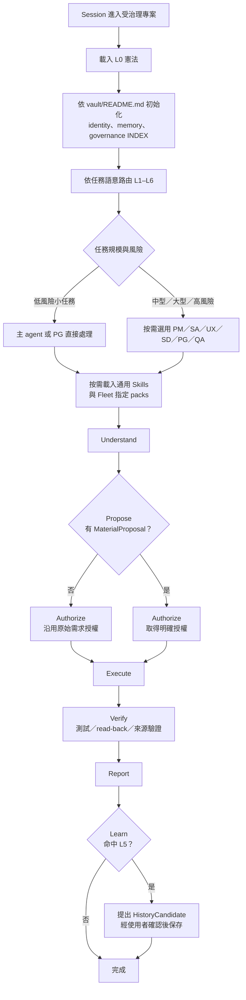

# projectD-core

個人擁有、provider-neutral、按需載入的 AI 治理核心。`core/` 保存跨專案治理與通用
Skills；`packs/` 保存依技術棧選用的 Skills。Canonical 內容只在本 repository 維護，
Claude、Codex 與 GitHub Copilot 使用相同來源。

## 核心模型

- L0 憲法常駐；L1–L6 由 `vault/governance/INDEX.md` 依任務語意路由。
- `core/skills/*` 可全域發現；`packs/*` 只接到 Fleet 中明確指定的專案。
- PM／SA／UX／SD／PG／QA 依任務風險選用，不強迫低風險工作跑完整角色鏈。
- TaskScopedProposalLoop 管理實質變更：Understand → Propose → Authorize → Execute →
  Verify → Report → Learn。
- Hooks、CI 與 Review 是獨立保護層，任何一層都不取代 L0 授權。

## 專案流程



權威流程見 [L1–L6 運作模型](vault/governance/operating-model.md)；需求書開發、功能維護與
Debug 的具體分流見 [需求驅動開發路由](vault/governance/requirement-driven-routing.md)。

## 目錄

| 路徑 | 用途 |
|---|---|
| `core/constitution/rules.md` | L0 憲法 |
| `core/agents/` | 六個可選角色 |
| `core/skills/` | 跨技術棧通用 Skills |
| `packs/` | 專案範圍技術棧 Skills；`_staging` 不可信、不可載入 |
| `vault/` | 身份、短工作記憶、治理路由與決策索引 |
| `fleet/` | 專案清單與 scoped pack 接線 |
| `evals/` | Deterministic governance schemas、catalogs 與 fixtures |
| `scripts/` | Desired-state wiring、檢查、hooks 與離線 evaluators |
| `docs/` | 現行 Specs、ADR 與操作手冊；研究及完成歷程移至 projectD-knowledge |

## 快速開始

Git 只同步本 repository 的 Canonical 內容。每台電腦的 `PROJECTD_CORE`、全域 Skill
junction、`fleet/fleet.json`，以及 DevSpace host 的登入／權限都屬本機狀態；首次 clone 或
換機同步後，仍需在該電腦執行接線，並在需要 Fleet 時依
[`fleet.json.example`](fleet/fleet.json.example) 建立本機清單。

```powershell
# 全域 core 接線
pwsh -File scripts/setup.ps1

# Fleet 入口與專案範圍 packs
pwsh -File scripts/fleet-governance.ps1 -Mode Apply

# 一般品質閘門
pwsh -File scripts/projectd-check.ps1

# 包含十一項 deterministic governance checks
pwsh -File scripts/projectd-check.ps1 -GovernanceEvals
```

所有 desired-state 操作都先檢查 ownership/conflict；途中失敗會回滾本次異動。移除接線：

```powershell
pwsh -File scripts/uninstall.ps1 -Mode Check
pwsh -File scripts/uninstall.ps1
```

## 操作索引

- [治理接線、Fleet、檢查與 Phase 3 離線工具](docs/operations/governance-workflow-and-checks.md)
- [ADR 決策索引](docs/adr/README.md)
- [DevSpace 現行安全邊界](docs/specs/devspace-security-boundary.md)
- [Fleet 說明](fleet/README.md)
- [Skill catalog](docs/operations/skill-catalog.md)
- [Governance Evals v2](docs/specs/governance-evals-v2.md)
- [Governance Evals v2 Phase 3](docs/specs/governance-evals-v2-phase-3.md)
- [Agent Runtime Governance](docs/specs/agent-runtime-governance.md)
- [Codex 本機 Live Pilot](docs/operations/runtime-governance-v2-codex-live-pilot.md)
- [Token 用量監控操作手冊](docs/operations/token-usage-monitoring.md)
- [外部 Skill 定向引入 ADR](docs/adr/0016-targeted-skill-intake.md)
- [KnowledgeWorkspace 核心邊界](docs/specs/knowledge-workspace-boundary.md)
- [KnowledgeWorkspace 正式規格](https://github.com/OliverMingHao1024/projectD-knowledge/blob/main/specs/external-knowledge-wiki.md)
- [本機 runtime state 外移規格](docs/specs/external-runtime-state.md)
- [研究報告歸檔](https://github.com/OliverMingHao1024/projectD-knowledge/tree/main/research)
- [可選專案歷程搜尋移機說明](core/skills/query-project-history/references/portable-setup.md)

## 目前邊界

- Governance Evals 的 catalog、synthetic trace 與 contract 通過，不代表真實模型或 live
  interception 已通過。
- Codex／Claude model adapters 只做授權後的 metadata-only manual import，不自行啟動模型；
  live host hooks 是另一條證據路徑。
- 2026-09-04 已完成 Codex 與 Claude 的 current-policy bounded single-host revalidation；這只
  證明實際走過的 read/bootstrap、workspace allow 與 out-of-scope command deny 路徑。
- Live runner、observers、broader pilots、paired authorization evidence、Copilot 與
  cross-host matrix 尚未完成。
- Pi runtime 不屬於 mandatory core；任何實驗必須維持 optional adapter。
- 本機 project-history runtime 不由一般 setup 自動下載或安裝。

## 瘦身護欄

- Session init 總量不得超過 10 KiB。
- 全域 Skill discovery metadata 不得超過 6,000 characters。
- `_staging` 不保存 adopted/rejected 候選的完整工作副本。
- CI 不得在 individual steps 與 aggregate check 重跑同一重型 contract。
- 沒有使用或品質證據時，不因名稱相似大量刪除專門 Skills 或 safety evals。
