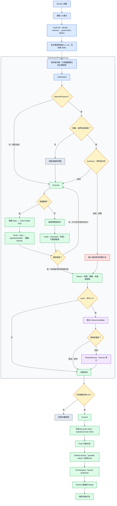

# projectD-core

從零設計、獨立維護的個人 AI 治理核心，不依賴外部 plugin。架構為 core + packs：
`core/` 是跨專案共用治理與通用 Skill，`packs/` 是依技術棧選用的 Skill。兩者都使用
開放的 `<name>/SKILL.md` 格式，canonical 內容只在本 repo 維護。

## 目錄導覽

| 路徑 | 用途 |
|------|------|
| `CLAUDE.md` | session 啟動協議 |
| `core/constitution/rules.md` | L0 憲法 |
| `core/agents/` | PM / SA / UX / SD / PG / QA 六個角色 agent |
| `core/commands/` | Claude Code 相容的 slash command（單檔 command）|
| `core/skills/` | 跨技術棧通用 Skill；每個子目錄以 `SKILL.md` 為入口 |
| `vault/` | 跨 session 記憶（身份、決策、制度路由、踩坑紀錄）|
| `packs/` | 依技術棧選用的技能包，目前：csharp、frontend-core、frontend-react、frontend-angular、frontend-angularjs、typescript、node-runtime、python |
| `fleet/` | 多專案共用本 repo 的說明與清單範例 |
| `scripts/` | 全域安裝／移機與 Fleet 治理檢查腳本 |

## 使用方式

一個專案要用 projectD-core，就在該專案裡引用 `core/` 加上該專案技術棧對應的
`packs/`。Fleet 專案以受管入口區塊接線，細節見 `fleet/README.md`。

## 整體 Workflow



Hook 只提供本機提早回饋；CI、branch protection、L0 授權與人工 Review
仍是獨立邊界，任一層不會因其他層存在而被取代。

## 全域安裝／移機

雙擊 `scripts/setup.bat`（或執行 `pwsh -File scripts/setup.ps1`）會把本 repo
同時接進 Claude Code 與 Codex，讓任何專案都能使用 projectD-core：

- 設定 `PROJECTD_CORE` 環境變數指向本 repo
- Claude：複製 `core/agents/{pm,sa,sd,pg}.md` 到 `~/.claude/agents/`
  （改了 agent 內容要重跑腳本才會反映）
- Claude：複製 `core/commands/*.md` 到 `~/.claude/commands/`
- Claude：用 junction 把 `core/skills/*` 與正式 `packs/*` 連到 `~/.claude/skills/`
- Codex／GitHub Copilot：共用 `~/.agents/skills/`，junction 仍指向相同 canonical Skill
- 在 `~/.claude/CLAUDE.md` 與 Codex home（預設 `~/.codex/AGENTS.md`）
  寫入/更新 `PROJECTD_CORE_START/END` 標記區塊；既有其他內容不會被覆蓋

各 AI 目錄只放 junction，不保存獨立內容；修改 repo 的 canonical Skill 會即時反映。`packs/_staging/` 不會接入。
若已設定 `CODEX_HOME`，Codex 的全域 `AGENTS.md` 會寫入該目錄。

### 定向引入外部 Skill

使用 `skill-scout` 依功能需求或指定 GitHub Skill URL 做唯讀檢查。它最多回傳三個
授權與格式合格的候選，不執行外部程式、不自動 staging，也不自行擴大搜尋。候選的機器
狀態在 `vault/governance/skill-registry.json`，人工理由在
`vault/governance/skill-candidates.md`；已採用 Skill 的 upstream 漂移由獨立
`skill-update-check` 檢查。使用者明確指定非 GitHub registry 時，依該 registry 的安裝
說明先下載至隔離目錄、完成靜態檢視並確認信任，再以 provider 座標、版本與 digest
登錄；尚無 update adapter 的 provider 會明確回報 `skipped`。

全域接線由同一份 `GovernanceWiring` desired state 管理。可先用
`pwsh -File scripts/setup.ps1 -Mode Check` 唯讀檢查；`Apply` 會先完成所有
ownership/conflict preflight，全部變更後再驗證，途中失敗只回滾本次異動。
本機 ownership state 位於 `.local/`，不進 Git。

**移機到新裝置**：把整個 `projectD-core` 資料夾複製或 `git clone` 到任意路徑，
執行 `scripts/setup.bat`（或 `pwsh -File scripts/setup.ps1`）即可，不需要手動
改任何路徑。腳本會自動定位自己所在位置。

**移除全域接線**：`scripts/uninstall.ps1`（或 `scripts/uninstall.bat`），
repo 本身不會被刪除。可先以 `scripts/uninstall.ps1 -Mode Check` 執行唯讀
ownership preflight；不屬於 projectD-core 的檔案、junction 或 environment
value 不會被移除。

### 可選：pre-push 治理 Hook

Hook 只是本機提早回饋，不取代 CI、branch protection 或 L0 授權邊界。
它只執行 repository-local、無網路與不改檔的治理檢查；不會背景監控或傳送 prompt。

```powershell
# 安裝（若已有非 projectD-core 擁有的 pre-push hook 會拒絕覆寫）
pwsh -File scripts/governance-hooks.ps1 -Mode Install

# 唯讀檢查安裝狀態
pwsh -File scripts/governance-hooks.ps1 -Mode Check

# 只移除帶有 projectD-core ownership marker 的 hook
pwsh -File scripts/governance-hooks.ps1 -Mode Uninstall
```

GitHub Actions 會獨立執行相同的可攜 repository 檢查；即使本機 Hook
未安裝或被繞過，PR 仍由 CI 提供一致的驗證。

## 可選：本機專案歷程搜尋

治理接線完成後，可另外執行 `scripts/setup-project-history.ps1`，建立本機
SQLite＋Hybrid Search。此能力是可選的，不會由一般 setup 自動安裝或下載。

- 所有 runtime、模型、allowlist 與 index 都在 `.local/project-history/`，不進 Git。
- 缺少 Python、套件或模型時會先詢問；未取得同意不下載。
- 公司未核准 embedding model 時可明確選擇 `-Mode lexical`，不會靜默降級。
- 公司與個人電腦只共用工具，不共用專案內容、模型 cache 或 index。
- 專案透過 `project add/list/remove` 管理本機 allowlist，不會自動掃描整台電腦。
- `rebuild/update` 使用暫存 index 驗證後原子替換，失敗時保留舊 index。

完整移機與受限網路說明見
[`portable-setup.md`](core/skills/query-project-history/references/portable-setup.md)。

## 設計原則

- 內容依實際使用累積，不預先假設涵蓋不到的情境
- 不依賴外部 plugin；需要時再個別評估引入，不整包依賴
- 每個 pack 只服務一個技術棧，不強迫所有專案共用所有技能
- L0 憲法常駐，L1–L6 只保留短路由並依任務語意按需載入
- PM／SA／UX／SD／PG／QA 是可選能力，不強迫低風險小任務跑完整流水線
- 行為變更與 bug 修復在條件允許時優先採 Red → Green → Refactor；
  無測試基礎設施的專案使用最小回歸驗證，不為形式擅自加依賴

### Unified projectD check

Run the read-only quality gate with PowerShell 7:

```powershell
pwsh -File scripts/projectd-check.ps1
pwsh -File scripts/projectd-check.ps1 -Json
```

治理核心、Skill routing 或授權規則有變更時，可選擇執行輕量治理 Eval：

```powershell
pwsh -File scripts/projectd-check.ps1 -GovernanceEvals
```

`-GovernanceEvals` 會分別檢查九層：

- structural eval：重要治理文字與入口同步契約；
- behavior catalog：provider-neutral 的真實 trial／tool event／final-state 評估契約；
- asset inventory：agent、model、Skill catalog、tool、MCP、plugin、credential 與 data source
  的來源、能力、權限及 disable 邊界；
- security trace replay：metadata-only synthetic fixtures，覆蓋 prompt injection、memory
  poisoning、tool misuse、exfiltration，以及 credential revoke、tool disable、egress deny、
  rollback 演練；
- host trial contract：驗證 Codex-first 的 host provenance、模型／CLI 版本、來源 integrity、
  checkpoint recovery 與 unavailable metrics 語意，不會在 CI 啟動真實模型；
- durable operation log：以 metadata-only intent/result records、pure reducer、current replay
  declaration 與 10 個 manual-drive action prefixes 驗證 crash/reopen/recovery；
- Codex／Claude host hooks：以同步 PreToolUse 在 effect 前寫入 intent、PostToolUse／
  PostToolUseFailure 在 effect 後寫入結果；契約驗證隱私、冪等、identity mismatch fail-closed
  與每個 tool call 的獨立 single-writer log，不會在 CI 啟動真實 host；
- paired upgrade gate：用相同 catalog／harness 的 baseline 與 candidate manifest 做離線比較，
  high／critical 失敗或整體通過數下降都會阻擋 promotion。
- Claude paired-pilot run plan：固定完整模型 ID、instruction／fixture digest、案例 observer、
  session／permission 邊界與 subscription-only 零額外支出規則；只驗證計畫，不會啟動模型。

Behavior catalog 通過只代表案例定義有效，不代表任何真實模型已通過。取得 host adapter
產生的結構化、已遮罩 trial trace 後，才使用下列命令做離線判分：

```powershell
pwsh -File scripts/governance-behavior-eval.ps1 `
  -TrialsPath <redacted-trials.json>

pwsh -File scripts/governance-trace-eval.ps1
```

Security trace replay 不會呼叫模型、讀取真實 credential 或變更網路；真實 host control
目前只有具 repo-local accepted after-action 的 `incident-derived` trace 能形成實際事件證據。
`host-captured` 要等授權 adapter 與 provenance contract 建立後才會開放，Phase 2 會拒絕該標籤。

Phase 3 的 Codex／Claude adapters 採手動授權匯入，不會自行啟動模型。輸入必須是可由 behavior
grader 判讀的 metadata-only trials；通過與失敗結果都會保留，避免只收錄成功樣本。
輸出只會寫到 Git ignored 的 `.local/governance/`：

```powershell
pwsh -File scripts/codex-governance-adapter.ps1 `
  -TrialsPath .local/governance/codex-trials.json `
  -RunId codex-governance-run `
  -ModelId <model-id> `
  -ModelVersion <model-version> `
  -StartedAt <ISO-8601> `
  -CompletedAt <ISO-8601> `
  -ApprovalCount 0 `
  -CompletedCriterion checkpoint-loaded `
  -RemainingCriterion resume-action `
  -SmokeTestId governance-smoke `
  -SmokeTestStatus passed `
  -CheckpointRead `
  -WorkspaceVerified `
  -AuthorizedManualImport
```

`-AuthorizedManualImport` 表示使用者已明確授權本次手動匯入，並對 trial 的 Codex 執行來源
負責；adapter 會自行讀取本機 `codex --version`、Git commit 與已追蹤工作樹狀態，但不會讀取
Codex session、prompt、credential 或 chain-of-thought，也不會把手動匯入標示為自動 capture。

Claude 使用相同契約與 grader；trial 的 `agent` 必須是 `claude`，harness 預設為
`claude-manual-import-v1`：

```powershell
pwsh -File scripts/claude-governance-adapter.ps1 `
  -TrialsPath .local/governance/claude-trials.json `
  -RunId claude-governance-run `
  -ModelId <full-model-id> `
  -ModelVersion <model-version> `
  -StartedAt <ISO-8601> `
  -CompletedAt <ISO-8601> `
  -ApprovalCount 0 `
  -CompletedCriterion trials-captured `
  -RemainingCriterion promotion-decision `
  -SmokeTestId governance-smoke `
  -SmokeTestStatus not-run `
  -AuthorizedManualImport
```

Claude adapter 會讀取本機 `claude --version`，但同樣不讀取 session、prompt、reasoning 或
credential，也不會自行呼叫 Claude。真實 runner 必須先具備固定 instruction digest 與獨立
observable-state grader，不能把模型自述直接當作成功證據。

Phase 3 的 durable-operation vertical slice 另以 metadata-only operation log 補足「effect 前
intent、effect 後 result」與 pure reducer。Repo-local `.codex/hooks.json` 與
`.claude/settings.json` 已把支援的 tool path 接至同步共用 handler；handler 只保存不可逆識別雜湊、
分類、授權狀態與結果代碼，不保存原始 tool arguments、output 或 error。Composite recovery gate 同時要求 operation state 可續跑、checkpoint
case 通過、current workspace 相符、smoke test 通過，以及三個 recovery effects 都已有成功結果：

```powershell
pwsh -File scripts/governance-operation-log-eval.ps1 `
  -OperationLogPath .local/governance/operation-log.json `
  -HostManifestPath .local/governance/host-trial.json `
  -CurrentSafeEffectKinds checkpoint-write,smoke-test,final-state-observation `
  -VerifyCurrentWorkspace
```

共用 handler 位於 `scripts/governance-host-operation-hook.ps1`，每個 tool call 的 evidence 寫到
Git ignored 的 `.local/governance/operation-hooks/<host>/`。Pre hook 成功時不輸出 allow decision，
因此不會略過 host 原有的 permission flow；無法先落盤或 identity 不一致時 exit 2、fail closed。
Repo-local hook 仍須經 host 的 project trust 機制啟用；Codex 會按 hook definition hash 要求檢視，
可用 `/hooks` 確認來源與信任狀態。未信任、被使用者／管理政策停用，或 host 未載入設定時，
contract 通過也不代表 live interception 已生效。Codex 同一事件的多個 matching hooks 會並行
啟動，因此其他 hook 自身造成的 side effect 不在這份 operation log 的 exactly-once 邊界。
Codex 官方列明 hosted tools（例如 WebSearch）及部分 specialized paths 不受此 hook 機制涵蓋；
Claude 的 `@` references 與 `EndConversation` 亦不在 hook coverage。Host policy 是否真的完成
task-scoped authorization 仍屬未驗證，所以這類 evidence 固定為 `host-hook-unverified`、
`authorization_verified=false`，不能單獨令 `safe_to_resume=true`。

Operation log schema 位於 `evals/schemas/governance-operation-logs.schema.json`。持久內容只允許
分類、授權、target code、argument digest、replay class 與 result code，不允許 raw prompt、
reasoning、tool arguments/output、秘密或私人資料。`safe` replay 只在 persisted declaration 與
current declaration 同時允許，且 effect 非 external／destructive 時成立；其他中斷狀態一律
要求 reconciliation。Hook contract 證明 repo-local handler 的 deterministic pre/post durability；
它不等同真實模型 pilot、完整 observer 或所有 host tool path 的 runtime 證明。

開始 pilot 前，先建立 repo-local、通常位於 `.local/governance/` 的 paired-pilot JSON，並執行：

```powershell
pwsh -File scripts/claude-governance-run-plan.ps1 `
  -PlanPath .local/governance/claude-paired-pilot.json
```

計畫 schema 是 `evals/schemas/governance-host-run-plan.schema.json`。它要求 baseline／candidate
使用不同且以 `claude-` 開頭的完整 model ID，拒絕 `opus`／`sonnet`／`haiku` 等浮動 alias；
catalog、共用 instruction 與每個 case fixture 都必須帶 SHA-256。Pilot 每個 case 固定一次，
總呼叫數為案例數乘兩個模型。現行契約只允許 `billing_mode=subscription-only`，
`additional_spend_allowed=false`，且 `per_trial_max_usd` 與 `total_max_usd` 都必須為 `0`；
訂閱額度耗盡時只能 `stop-and-wait`，不得切換 API、usage credits 或其他按量計費來源。
Observer 會依 catalog 的 final state／event 期待做覆蓋檢查。目前這個入口只輸出執行投影，
`live_execution` 永遠是 `false`，不會因 plan 通過就產生費用。

取得兩次已驗證的 host trial 後，可執行離線升級閘門：

```powershell
pwsh -File scripts/governance-host-upgrade-gate.ps1 `
  -BaselineManifestPath .local/governance/baseline.json `
  -CandidateManifestPath .local/governance/candidate.json
```

閘門不會啟動模型或變更 workspace。兩份 manifest 必須使用相同 evidence kind、host／
harness／adapter、catalog digest、case set 與每個 case 的 trial count，run id 不同且
model identity 有變更。
候選版不得有 high／critical 失敗，passed count 也不得低於 baseline；token／cost 任一側
無資料時，其差值維持 `unavailable`。

Schema 位於 `evals/schemas/`；canonical cases 與 repository 可驗證資產分別位於
`evals/governance-behavior-cases.json` 與 `evals/governance-assets.json`。Host 動態提供但
repository 無法驗證的 tool、MCP、plugin、credential 或精確 model version 必須由 host／
project inventory 補充，不得因 canonical inventory 通過而視為已治理。

這組 deterministic baseline 位於 `evals/governance-baseline.json`，只驗證高影響治理契約；
一般小任務與本機 pre-push 不會預設執行。CI 會執行其 contract，防止治理行為無意退步。

The command validates every canonical Skill in `core/skills/` and `packs/`, including
portable frontmatter, folder/name agreement, duplicate names, and the Skill registry's
source/candidate/decision-record relationships. It also validates fleet paths/packs,
retired pack references, and global/fleet wiring. It returns a non-zero exit code when
any check fails. Use `-ProjectRoot` for another checkout; `-SkipWiring` is reserved for
isolated fixture tests.
