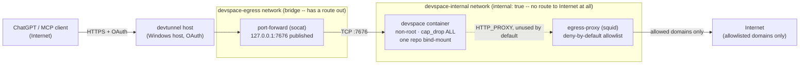

# DevSpace Isolation Container Framework

Implements the isolation posture `docs/adr/0015-isolate-ai-agent-mcp-server-execution.md`
requires before any AI-agent MCP server with file/shell execution capability
may be reintroduced. See `docs/specs/devspace-isolation-container-framework.md`
for the full spec.

Runs the real [DevSpace](https://github.com/Waishnav/devspace)
(`@waishnav/devspace` on npm, MIT licensed) inside that isolation posture --
this is no longer a placeholder. DevSpace is a self-hosted MCP server that
lets ChatGPT/Claude read, edit, search, and run code in a chosen local
project; see its own `docs/security.md` for its threat model. This framework
exists because that model explicitly says "shell commands run as local
commands and can do what your user account can do" -- the isolation here
bounds "your user account" down to a locked-down container instead of your
real Windows account.

## Network topology



`devspace` has no edge to `inet` in this diagram on purpose: its only network
is `devspace-internal`, which is Docker-`internal: true` and therefore has no
gateway to anything outside it. `egress-proxy` and `port-forward` are the only
two services that also join `devspace-egress`, which is what makes either of
them reachable from (or able to reach) the outside world at all -- see
"Architecture note" below for why `port-forward` has to exist for that reason
alone, and "Squid allowlist" for why `egress-proxy`'s side of that route is
still policy-enforced, not just topology.

## What "rootless" means here

This runs under Docker Desktop for Windows (WSL2 backend), not a native Linux
rootless `dockerd`. The daemon itself still runs with elevated privileges
inside the WSL2 VM -- that is Docker Desktop's architecture, not something
this framework changes. What this framework actually provides:

- the container's own process runs as a non-root user (UID 10001)
- `no-new-privileges` and a full capability drop
- read-only root filesystem (except the one bind-mount and one named config
  volume, both of which remain writable by design)
- exactly one host bind-mount, no Docker socket, no route to the internet
  except through the egress proxy

This is a real, meaningful reduction in blast radius. It is **not** the same
guarantee as "a container escape doesn't reach the host" -- that would need a
native rootless daemon or a VM boundary, both of which ADR 0015 considered and
rejected for this personal, single-user context. Don't oversell it as more
than it is.

All three services (`devspace`, `egress-proxy`, `port-forward`) run
`cap_drop: [ALL]` -- `egress-proxy` (squid) initially could not, because the
official `ubuntu/squid` image's squid.conf default (`cache_effective_user
proxy`) makes squid call `setgid`/`initgroups` on itself internally, which
needs `CAP_SETGID`. Fixed by starting that one container already as uid/gid
13 (`user: "13:13"` in docker-compose.yml, matching squid's own target
`proxy` user) so squid has nothing left to drop -- confirmed via
`/proc/1/status` showing an all-zero capability set with the proxy still
enforcing its allowlist correctly. See
`docs/specs/devspace-isolation-container-framework.md`'s "egress-proxy 最小
權限強化" addendum for the full diagnosis.

## Usage

```bash
cp .env.example .env
# edit .env: set DEVSPACE_REPO_PATH (the one folder DevSpace may touch) and
# DEVSPACE_OAUTH_OWNER_TOKEN (a long random secret -- e.g. `openssl rand
# -base64 32`); leave DEVSPACE_PUBLIC_BASE_URL blank for local-only testing
docker compose up -d --build
```

DevSpace is then listening on `http://127.0.0.1:7676/mcp` on the host --
loopback only, nothing on the LAN can reach it. That address is served by the
`port-forward` relay, not `devspace` directly (see Architecture note below).
Point a tunnel or reverse proxy at that address to expose it publicly;
DevSpace does not manage tunnels itself (its own `docs/security.md`). Set
`DEVSPACE_PUBLIC_BASE_URL` in `.env` to that tunnel's public origin once one
exists, then restart the container. See "Exposing DevSpace publicly" below
for the tunnel this deployment actually uses and the exact ChatGPT connector
steps, including two non-obvious pitfalls that cost real debugging time.

Verify the isolation actually holds:

```powershell
pwsh -File scripts/verify-isolation.ps1
```

This brings its own stack up and down in a scratch directory with a throwaway
Owner token -- it does not require `.env` or a running `docker compose up`
first, and it will not affect one you already have running (compose project
names differ, so they don't collide, but avoid running both at once to keep
the output easy to read).

## Squid allowlist

`squid/allowed-domains.txt` ships with exactly one entry, `example.com`,
which exists **only** so `verify-isolation.ps1` has something to prove the
allow-path works. DevSpace's own package is installed at Docker *build* time
(a separate, unrestricted network context), so the running container needs no
runtime egress for DevSpace's core file/shell/MCP duties -- the allowlist can
stay this narrow unless something inside genuinely needs to phone out (an
update check, a package script a workspace runs, etc.). Add domains only when
something actually needs them, not speculatively.

`squid.conf` denies private/loopback/link-local destination IP ranges
outright, before the domain allowlist is even consulted -- this protects
against a future allowlisted domain resolving (now, or via DNS rebinding
later) to an internal address that `egress-proxy` could otherwise reach,
since it sits on both networks. This doesn't need updating when you add
real domains later.

## Known gotcha: git operations inside `/workspace`

`docker-entrypoint.sh` runs `git config --global --add safe.directory
/workspace` on every start. Without it, every git command inside the
container fails with `fatal: detected dubious ownership in repository at
'/workspace'` -- confirmed live: ChatGPT's first real `bash` tool call
after connecting hit exactly this. The bind-mounted repo's reported
ownership (via Docker Desktop's Windows/WSL2 bind-mount translation)
essentially never matches the container's UID 10001; this tells git to
trust the one path this container was already explicitly given, nothing
broader.

Also worth knowing: `/workspace` is always exactly the one folder
`DEVSPACE_REPO_PATH` points at (`D:/workspaces/projectD-core` in this
deployment) -- not its parent `D:/workspaces`, and not switchable per
ChatGPT session. Seeing more than one project from ChatGPT would mean
either mounting a broader host directory (giving up the single-repo
boundary ADR 0015 requires) or changing `DEVSPACE_REPO_PATH` and
restarting the container to point at a different project one at a time.
This deployment deliberately keeps the narrower, single-project scope.

## Config

The installed version, `@waishnav/devspace@1.0.8`, is configured through
plain env vars (`HOST`, `PORT`, `DEVSPACE_ALLOWED_ROOTS`,
`DEVSPACE_OAUTH_OWNER_TOKEN`, `DEVSPACE_PUBLIC_BASE_URL`) -- **not** the
`config.jsonc` system described in DevSpace's main-branch
`docs/configuration.md`. That doc describes a newer config model that
apparently hadn't shipped to npm as of 1.0.8; a `config.jsonc` written to
`$DEVSPACE_CONFIG_DIR` had zero observable effect when tested. If a future
image bump upgrades past whatever version introduces that system, revisit
`docker-entrypoint.sh` -- it may need to write a config file instead of (or
alongside) exporting env vars.

`docker-entrypoint.sh` sets `HOST=0.0.0.0`, `PORT=7676`, and
`DEVSPACE_ALLOWED_ROOTS=/workspace` unconditionally (these are fixed by this
framework's design, not meant to be end-user configurable), and exports
`DEVSPACE_PUBLIC_BASE_URL` only when `DEVSPACE_ISOLATION_PUBLIC_BASE_URL` is
non-empty -- **do not** rename that back to `DEVSPACE_PUBLIC_BASE_URL` in
`docker-compose.yml`'s `environment:` block; 1.0.8 crashes with "Invalid
URL" if that variable is merely present as an empty string, which is exactly
what an unset `.env` value would otherwise produce.

## Architecture note: why there's a `port-forward` service

`devspace`'s own network is `devspace-internal` (`internal: true`), and
Docker does not wire up published-port forwarding for a container whose only
network is `internal: true` (confirmed by testing: `docker port` came back
empty and the host could not connect at all, regardless of what the process
inside was bound to). `port-forward` (a bare `socat` relay) is attached to
both `devspace-internal` and the non-internal `devspace-egress` network
specifically so it *can* publish a port, and its only job is forwarding
`host:7676` to `devspace-isolated:7676`. It carries none of `devspace`'s
capability -- no filesystem access, no shell -- so its presence on a
non-internal network doesn't weaken `devspace`'s own isolation.

## Exposing DevSpace publicly (Microsoft Dev Tunnel)

This deployment uses [Microsoft Dev Tunnel](https://aka.ms/devtunnels/docs)
(`devtunnel` CLI, `winget install --id Microsoft.devtunnel`), chosen over
Cloudflare Tunnel because a named Cloudflare tunnel requires a zone (a domain
already added to a Cloudflare account) before it will even finish login --
this account had none. Anonymous public tunnels are governance-restricted
(`scripts/governance-command-policy-hook.ps1`); using `devtunnel
--allow-anonymous` here is a deliberate, narrow, documented exception --
see `docs/adr/0017-allow-anonymous-devtunnel-for-isolated-devspace-on-personal-registrations.md`.
It only applies on a repo/machine registered `personal`.

```bash
devtunnel user login -d          # -d forces pure device-code auth; without
                                  # it, at least one CLI build (1.0.2030) got
                                  # stuck on a broken browser-auth fallback
                                  # that redirects to a dead localhost page
devtunnel create devspace-projectd
devtunnel port create devspace-projectd -p 7676 --protocol http   # NOT https --
                                  # DevSpace serves plain HTTP; --protocol
                                  # https here silently produces 502s with no
                                  # useful error, because the relay tries (and
                                  # fails) to speak TLS to a plaintext backend
devtunnel access create devspace-projectd -p 7676 --anonymous
devtunnel host devspace-projectd
```

The `host` command prints the public URL (`https://<id>-7676.<region>.devtunnels.ms`).
Put that in `.env`'s `DEVSPACE_PUBLIC_BASE_URL` and restart the container
(`docker compose up -d --build`) so `docker-entrypoint.sh` picks it up.
Tunnels expire after 30 days; re-running `devtunnel host` (same tunnel ID)
renews it and keeps the same public URL. `devtunnel host` runs via a
Windows Scheduled Task (`schtasks`, trigger `ONLOGON`, name
"DevSpace Dev Tunnel") rather than a native Windows service -- `devtunnel`
has no built-in service-install mode. Recreate it with:

```powershell
$devtunnel = "C:\Users\User\AppData\Local\Microsoft\WinGet\Packages\Microsoft.devtunnel_Microsoft.Winget.Source_8wekyb3d8bbwe\devtunnel.exe"
schtasks /Create /TN "DevSpace Dev Tunnel" /TR "`"$devtunnel`" host devspace-projectd" /SC ONLOGON /RL LIMITED /F
```

### Connecting ChatGPT

1. Settings → 安全性與登入 (Security & login) → 開發者模式 (Developer mode) --
   turn it on. OpenAI's own warning applies as written: this allows adding
   unverified connectors, which can permanently modify or delete data.
2. Open the composer's `+` menu → 瀏覽外掛程式 (Browse plugins) -- this is
   the actual "Connectors" page in this build; searching for a settings tab
   literally named "Connectors" will not find it.
3. Click the `+` next to the plugin search box → fill in Name, the Server
   URL (`https://<your-tunnel>.devtunnels.ms/mcp` -- keep the `/mcp` suffix
   here, unlike `server.publicBaseUrl`/`DEVSPACE_PUBLIC_BASE_URL`, which must
   NOT include it), leave Authentication as OAuth, check the risk
   acknowledgment box, click 建立 (Create).
4. Click 使用 DevSpace 登入 (Sign in with DevSpace) -- this opens DevSpace's
   own Owner-password approval page (confirm the `RESOURCE` field shown there
   matches your tunnel URL before entering anything).
5. Paste the Owner password from `.env`'s `DEVSPACE_OAUTH_OWNER_TOKEN`
   **exactly**, including a trailing `=` if the base64 value has one --
   `cut -d= -f2` or similar shell one-liners that split on `=` will silently
   truncate a token ending in base64 padding and produce "The Owner password
   was not accepted" with no indication why. Copy the whole value from the
   file, not from a piped/derived command.

A successful connection shows `已使用授權: OAuth` and a connection date in the
connector's detail page.

## Cross-reference

This framework controls what a running DevSpace can reach (network, host
credentials, filesystem). `scripts/governance-command-policy-hook.ps1` and
`vault/governance/project-classification.json` control which
repositories/machines are allowed to invoke DevSpace tools at all. Both are
required; neither substitutes for the other.
