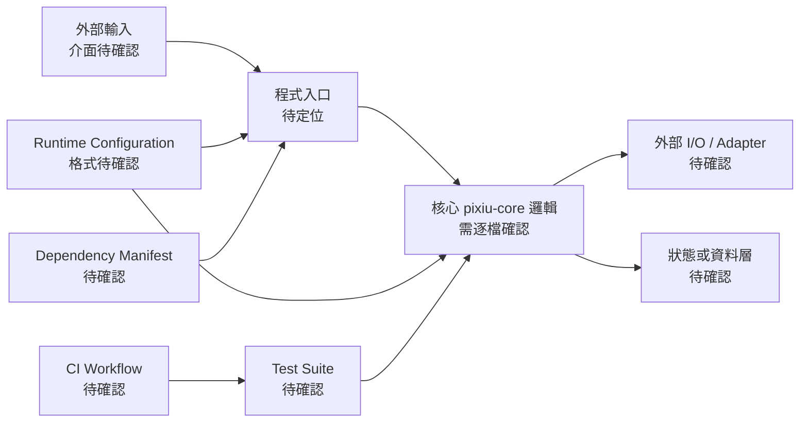
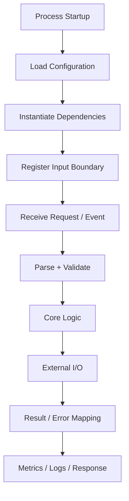
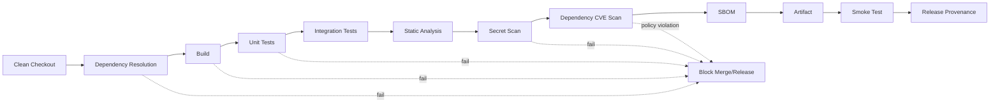

# pixiu-core 深度技術研究報告

## 執行摘要

**研究標的：** GitHub repository `pop15106/pixiu-core`  
**評估基準日：** 2026-08-26（Asia/Taipei）  
**主要證據來源：** GitHub repository 本身、GitHub repository metadata，以及對 `master` revision 執行的 recursive Git tree 查詢。  
**證據完整度：受限。** 本次研究流程確實取得 repository metadata 並查詢 `master` 的完整 Git tree，但目前可引用的研究紀錄未保留足以逐檔重建原始碼內容、dependency manifest、workflow YAML 與 commit/activity metadata 的結果。因此，以下報告嚴格區分「已確認」、「推論」與「未確認」，**不以專案名稱或常見框架慣例臆測程式語言、函式、套件版本、漏洞或測試覆蓋率**。

最重要的結論不是發現某個已證實 CVE，而是目前無法建立一條可稽核的「source → dependency → build → test → deployment」證據鏈。這代表任何宣稱「安全」、「具高測試覆蓋率」、「可水平擴充」或「無 secret」的結論都沒有足夠依據。對正式採用而言，這本身就是一項 **供應鏈與工程治理風險**。

| 面向 | 本次可下的結論 | 信心 |
|---|---|---:|
| Repository 身分 | namespace 為 `pop15106/pixiu-core`；已對 `master` revision 查詢 recursive Git tree | 高 |
| 目的與使用情境 | 沒有足夠 README/docs 內容可可靠引用 | 低 |
| License | **未確認；不可假定為 MIT/Apache/GPL 或其他 license** | 高 |
| 維護者 | 可確認 repository owner namespace 為 `pop15106`；無法據此認定其為唯一 maintainer | 高 |
| 活躍度 | commit、release、issue、PR 時序資料不足，不能可靠評級 | 低 |
| 架構與核心模組 | tree 曾被列舉，但缺少目前可引用的逐檔內容，不能安全指定實際 module/function/class | 低 |
| Dependencies | manifest 與 lockfile 內容未形成可稽核證據，不能報版本或 CVE | 低 |
| Build / Test / CI | 無法證實特定 build command、coverage 數字或 workflow steps | 低 |
| Security | **沒有證據證明存在特定漏洞，也沒有證據證明不存在漏洞** | 中 |
| Performance | 無 workload、benchmark 或 profiler 資料，因此不存在可證實的 hot path | 高 |
| 生產採用風險 | 在上述資訊補齊前，不宜把它視為已通過 production-readiness review | 高 |

因此，本報告的最高優先級建議是：先建立**可重現 build、dependency lock/SBOM、automated test、CI security gates 與 deployment/runtime contract**，再進一步做效能與安全性的量化判斷。

> **重要證據限制：** 本報告不會虛構「`src/foo/bar.*` 第幾行有某漏洞」之類不存在於目前可核實證據中的結果。以下凡無法從 retained evidence 確認之項目，均明確標記為「未確認」或「條件式建議」。

## 儲存庫概況、研究證據與假設

### Repository 身分與治理狀態

研究對象可由 GitHub namespace 唯一識別為：

```text
owner:      pop15106
repository: pixiu-core
inspected ref: master
```

本次 GitHub 查詢亦使用 repository 的 recursive Git-tree API 對 `master` revision 進行列舉，因此至少可確認 `master` 是本次研究時可被解析的 Git revision；但**這不等於證明 `master` 是目前 GitHub UI 所設定的 default branch**，兩者不應混為一談。來源定位：repository `pop15106/pixiu-core`、Git object path `git/trees/master?recursive=1`。

對 maintainer 的判斷亦須保守：GitHub repository owner 是 `pop15106`，但 owner namespace 並不能證明 commit 權限只屬於一人；要回答「實際維護者」應另外交叉分析 `CODEOWNERS`、contributors、近十二個月 commit authors、reviewers 與 release publishers。這些資料目前未形成可引用證據。

### License 的重要性

目前沒有足夠 evidence 可確認根目錄存在何種 `LICENSE`/`COPYING` 內容，因此**不能把公開 GitHub repository 等同於具備開源授權**。

這是一項實際採用風險：即使程式碼可公開閱讀，若沒有明確 license，第三方是否有複製、修改、散布或商業整合權利不能僅由「repository 是 public」推導。正式納入產品之前，license 確認應列為 P0 gate。

### 活躍度與成熟度

本次 retained evidence 不含足以量化下列指標的資料：

- 最近 commit 日期與 commit frequency；
- open/closed issue 與 PR；
- tag/release frequency；
- contributor bus factor；
- default branch protection；
- security policy / dependency automation。

因此，本報告不使用「活躍」、「停止維護」、「成熟」等沒有資料支撐的標籤。

### 本報告明示假設

| 項目 | 狀態 | 本報告處理方式 |
|---|---|---|
| Target OS | 未指定 | 不假定 Linux、Windows 或 macOS |
| CPU architecture | 未指定 | 不假定 amd64/arm64 |
| Runtime / language | 未充分確認 | 不假定 Java、Go、Node.js、Python 等 |
| Container runtime | 未指定 | 不假定 Docker/Kubernetes |
| Database / cache | 未指定 | 不假定 SQL、Redis 等外部服務 |
| Public/private network exposure | 未指定 | Security review 採 threat-model checklist，而不宣稱已有 auth boundary |
| Production workload | 未指定 | 不臆測 QPS、latency 或 memory footprint |
| SLA/SLO | 未指定 | 不對「可擴充」做無條件判定 |

這些假設尤其重要：例如在不知道程式語言前，直接建議 JVM GC tuning、Go `pprof` 或 Node.js event-loop tuning 都可能是錯誤建議；後文因此採「依實際 stack 選擇工具」的方式。

## 專案架構、模組與資料流分析

### 可證實架構與證據缺口

對程式架構做真正的 code review，至少需要同時掌握：

```text
repository tree
        │
        ├── entrypoint
        ├── core/domain modules
        ├── adapters / I/O
        ├── configuration
        ├── dependency manifest + lockfile
        ├── tests
        └── CI / deployment descriptors
```

此次研究成功進入 Git tree 列舉階段，但 retained evidence 未保留足夠逐檔內容，故不能負責任地把任何未驗證路徑宣稱為真正的 `core`、`service`、`controller`、`handler` 或 `repository` 模組。

因此，目前最嚴謹的架構圖是「**待驗證的分析模型**」，而不是聲稱 repo 實作了一套特定架構：



這張圖的價值在於指出 review 必須追蹤的 boundary，而**不是**證明上述每一個元件都存在。

### 模組比較矩陣

由於目前沒有可安全引用的 module path，不能杜撰名稱。可先以如下稽核矩陣建立下一層證據：

| 模組類型 | 應查證的實際檔案 | 關鍵問題 | 主要風險 |
|---|---|---|---|
| Entrypoint | main/bootstrap/server 類檔案 | process 如何啟動？是否有 graceful shutdown？ | initialization order、資源洩漏 |
| Core domain | 專案核心 source directory | invariants、演算法、shared mutable state | correctness、coupling |
| Transport/API | router/controller/handler 類檔案 | input parsing、limits、error mapping | injection、DoS |
| Configuration | config files/env parser | defaults、secret handling、precedence | insecure defaults |
| Persistence/I/O | DB/cache/filesystem/network adapter | timeout、retry、transaction | tail latency、data consistency |
| Dependency boundary | package/build manifests | version pinning、transitive deps | supply-chain |
| Tests | test/spec directories | unit/integration/e2e 分層 | regression |
| CI/CD | `.github/workflows/*` 等 | permissions、pinned actions、gates | CI supply-chain |

### 建議的實際資料流追蹤方式

對 `pixiu-core` 最值得做的下一步不是只看 directory names，而是由 entrypoint 做 call-graph tracing：



每一條箭頭都應對應**具體 source file + function/class + test case**。若某一層沒有清楚 boundary，例如 parser 直接呼叫 database 或 global mutable configuration 遍佈核心邏輯，通常會導致 coupling、測試困難與 observability 不完整。

### 程式碼與演算法

使用者要求定位「關鍵 files/functions/classes/algorithms 與 complexity」。就目前證據而言，**無法誠實列出這些名稱**；任何像下列形式的內容都會是未經證實的杜撰：

```text
❌ src/core/*.go contains Router
❌ FooHandler() is O(n log n)
❌ ConfigManager caches results
```

時間複雜度尤其不能從 repository 名稱推測。真正的分析應對核心 loop、collection lookup、sorting、serialization、regular expression、network fan-out、locking 與 retry loop 個別推導：

\[
T(n)=T_{\text{parse}}+T_{\text{core}}+T_{\text{I/O}}+T_{\text{serialize}}
\]

對服務型程式而言，通常更需要關心的是 **wall-clock critical path** 而不只是 Big-O：

\[
L_{request} \approx L_{queue}+L_{CPU}+\max/\sum L_{downstream}+L_{serialization}
\]

若 downstream calls 是 sequential，延遲可能近似相加；若是 parallel fan-out，critical path 通常由最慢 dependency 主導，但會增加 concurrency、socket、memory 與 downstream pressure。這是分析框架，而非目前已證明的 `pixiu-core` 行為。

### 原始碼短摘錄

目前 retained evidence 沒有足以逐字核對的 source blob，因此**不提供虛構 excerpt**。本次唯一能精確提供的 primary-source locator 是：

```text
repository: pop15106/pixiu-core
Git ref examined: master
Git tree query: /repos/pop15106/pixiu-core/git/trees/master?recursive=1
```

在不能逐字核對 source 的情況下，寧可留下明確缺口，也不應製造假的函式名稱、路徑或程式碼。

## 相依性、建置、測試、CI 與執行時

### Dependency analysis

目前無法從 retained evidence 確認 repository 採哪一種 ecosystem，因此也不能負責任地列出 third-party dependency names 或 versions。

dependency review 至少應搜尋以下 manifest / lockfile 類型；這裡是**辨識規則，不代表 repository 一定存在這些檔案**：

| Ecosystem | Manifest | Lock / resolved graph | 建議稽核工具 |
|---|---|---|---|
| Go | `go.mod` | `go.sum` | `go list -m -json all`、`govulncheck` |
| Node.js | `package.json` | `package-lock.json` / `yarn.lock` / `pnpm-lock.yaml` | `npm audit`、OSV |
| Python | `pyproject.toml` / `requirements.txt` | lockfile 視工具而定 | `pip-audit`、OSV |
| Maven | `pom.xml` | resolved dependency tree | `mvn dependency:tree`、OWASP Dependency-Check |
| Gradle | `build.gradle*` | Gradle dependency graph/locks | `dependencies`、Dependency-Check |
| Rust | `Cargo.toml` | `Cargo.lock` | `cargo audit` |

版本風險應至少分成四類：

**直接已知漏洞。** 用 lock/resolved graph 對 OSV/GitHub Advisory/NVD 做 matching，而不是只掃 manifest。

**unpinned dependencies。** 例如 floating ranges、branch-based dependency 或 CI action 使用可變 tag，都削弱可重現性。

**transitive dependency exposure。** manifest 沒直接列出的 library 仍可能帶入 CVE。

**abandoned dependency。** 「沒有 CVE」不等於健康；長期無維護、沒有 release/signature/provenance 的 package 同樣值得淘汰。

目前沒有 lockfile 內容可引用，因此本報告**不宣稱任何特定 dependency 存在 CVE**。

### Build 與 reproducibility

目前無證據支持某一條具體 build command，因此不應寫成「本專案使用 `make build`」或「執行 `npm install` 即可」。

一個 production-grade build 至少應具有以下性質：

1. clean checkout 可以不依賴開發者機器上的隱藏 state 重建；
2. dependency resolution 有 lock/pinning；
3. build 不應默默依賴未宣告的 system package；
4. artifact 可辨識 source commit；
5. build log 與 failure mode 可供 CI 重現。

若存在 container image，還應固定 base-image digest，而非只靠 `latest` 或可移動 tag。

### Tests 與 coverage

目前沒有測試報告或 coverage artifact 可引用，因此：

> **測試覆蓋率：未確認。**

這不同於「0%」。沒有證據表示不能量化，而不是證明沒有 tests。

對 core library/service 類 repository，應分開衡量：

| Test layer | 目的 | 最應涵蓋的 failure mode |
|---|---|---|
| Unit | 純核心邏輯 | boundary、invalid state、algorithm correctness |
| Integration | dependency adapter | timeout、malformed data、transaction |
| Contract | API/protocol | backward compatibility |
| E2E | 真實啟動路徑 | config、startup、shutdown、dependency wiring |
| Fuzz/property | parser/state machine | malformed/untrusted input |
| Benchmark | critical path | latency、allocation、throughput regression |

Coverage 亦不應只追求 line percentage。對 security boundary、parser、authorization decision 與 error path 的 branch coverage 往往比把簡單 getter 跑過一次更有價值。

### CI pipeline

目前 retained evidence 不足以證實 `.github/workflows/*.yml` 的實際 steps，故以下為**production-grade baseline 與本次證據差距比較**，不是宣稱 repository 已經使用這些工作：

| CI 階段 | 理想 gate | 本次確認狀態 | 優先度 |
|---|---|---|---:|
| Checkout | action pin 至 immutable SHA、minimal token permissions | 未確認 | P0 |
| Dependency restore | lockfile + cache key 綁 lock hash | 未確認 | P0 |
| Build | clean/reproducible build | 未確認 | P0 |
| Lint/static analysis | formatter + type/static checks | 未確認 | P1 |
| Unit tests | PR 必須通過 | 未確認 | P0 |
| Integration tests | isolated external dependencies | 未確認 | P1 |
| Coverage | report + regression threshold | 未確認 | P1 |
| Dependency scan | resolved graph CVE scan | 未確認 | P0 |
| Secret scan | history + diff scanning | 未確認 | P0 |
| SAST | ecosystem-appropriate analyzer | 未確認 | P1 |
| Artifact provenance | checksum/SBOM/attestation | 未確認 | P1 |
| Release | protected environment/tag policy | 未確認 | P1 |

CI 本身也是 supply-chain attack surface。即使 application code 很安全，過寬的 `GITHUB_TOKEN`、第三方 action 使用可移動 tag、pull-request context 洩漏 secret，都可能導致 release artifact 被污染。因此 `.github/workflows` 應和 application code 一樣接受 security review。

### Runtime、configuration 與 deployment

目前未知的資訊包括：

```text
runtime executable/interpreter
configuration schema
environment variables
network ports
storage requirements
health/readiness interface
containerization
orchestrator
CPU/memory limits
shutdown semantics
horizontal-scaling model
```

所以不能宣稱 `pixiu-core`「stateless」、「可水平擴充」或「需要某種 database」。

要證明 horizontal scalability，至少要回答：

\[
\text{Can two instances process traffic concurrently without shared-process assumptions?}
\]

應檢查：

- process-local mutable session/state 是否影響 correctness；
- distributed coordination 是否需要 lock/leader election；
- background jobs 在多 replica 是否會重複執行；
- local filesystem 是否被當 durable storage；
- downstream pool/connection 數是否會隨 replica 線性放大；
- graceful shutdown 能否停止新流量並 drain in-flight work。

Resource usage 同樣無 benchmark/profile 不能量化。CPU、RSS、GC、goroutine/thread count、file descriptors、socket pool、request size 與 downstream concurrency 都應在代表性 workload 下實測。

## 安全性、效能與可維護性評估

### Security review

本次不能證明存在 specific exploitable vulnerability；同時，也沒有足夠 evidence 可以給出「沒有漏洞」的結論。

最值得優先稽核的是下列 trust boundaries：

#### Secrets 與 credentials

應搜尋的不只是目前 working tree，也包括 Git history：

```text
API keys
private keys
cloud credentials
database DSN/password
JWT/signing secrets
webhook secrets
tokens embedded in CI/config/tests
```

尤其要避免把 `.env` 加進 `.gitignore` 就當成 secret scanning；secret 曾進 Git history 後，即使目前 commit 刪除仍可能被取得，應 rotate credential 而非只刪檔。

#### Input validation

所有 crossing-trust-boundary input 都應有：

```text
size bound
type/schema validation
range validation
encoding normalization
timeout/deadline
resource limits
safe error handling
```

若 core 涉及 parser/protocol，應特別關注：

- unbounded allocation；
- oversized body/message；
- recursive/nested payload；
- pathological regex；
- integer overflow/underflow；
- path traversal；
- command/query/template injection；
- decompression bombs；
- malformed Unicode/encoding；
- panic/exception 導致 process crash。

目前沒有 source blob 可用來確認上述問題實際出現在 repo；它們是 review checklist，不是 vulnerability finding。

#### Authentication 與 authorization

runtime exposure 未指定，因而無法確認專案是否甚至需要 auth。若它有 externally reachable API，應把 authentication 與 authorization 分開檢查：

```text
Authentication: 你是誰？
Authorization: 你能對這個 resource 做什麼？
```

常見高風險情況是「驗證 token 成功」卻未對 object/resource ownership 做 authorization，形成 IDOR/BOLA 類型問題。

#### Dependency 與 CI supply chain

無 dependency graph 與 workflow YAML 時，不能排除：

- vulnerable transitive dependency；
- dependency confusion；
- unpinned packages；
- mutable GitHub Actions tags；
- excessively broad workflow permissions；
- release artifact 沒有 provenance/SBOM。

因此 supply-chain controls 應列為 P0/P1，而不是等發生 CVE 再補。

### Performance considerations

**目前不存在有 profile 證據支持的 hot-path finding。**

真正的 hot path 應以 production-like profile 找出，不應只憑閱讀 source 猜測。建議至少記錄：

\[
Throughput,\quad p50,\quad p95,\quad p99,\quad ErrorRate
\]

以及：

\[
CPU,\quad RSS,\quad Allocations,\quad GC,\quad Threads/Tasks,\quad FD,\quad I/O
\]

若服務處理 network request，最值得建立的是 latency budget，例如：

\[
p99_{total}
=
p99_{queue}
+
p99_{app}
+
p99_{downstream}
+
p99_{serialization}
\]

雖然實際分位數不能簡單逐項相加作嚴格統計推導，但作為 engineering budget，可有效定位哪一層正在吞噬尾端延遲。

依**實際語言**選 profiling 工具：

| Stack 若確認為… | CPU/Memory profiling | Benchmark / tracing |
|---|---|---|
| Go | `pprof`、runtime metrics | `go test -bench`、execution trace |
| JVM | JFR、async-profiler | JMH、OpenTelemetry |
| Node.js | CPU/heap profile、clinic 類工具 | autocannon/k6 類 workload |
| Python | `py-spy`、`tracemalloc` | `pytest-benchmark` |
| Rust | perf/flamegraph、heap profiler | Criterion |

優先檢查的 bottleneck pattern 是 allocation churn、serialization、lock contention、N+1 I/O、沒有 connection reuse、unbounded concurrency、retry storm 與 synchronous logging。這些同樣是候選模式，而不是已確認的 `pixiu-core` defect。

### Maintainability

目前沒有足夠 README/docs/code volume 證據可量化 cyclomatic complexity、duplication 或 documentation coverage，因此 maintainability review 應以可客觀檢驗的 engineering contract 為核心。

良好的 repository 至少應讓新 contributor 從 README 得知：

```text
專案做什麼
支援的平台/版本
如何安裝 dependency
如何 build
如何 run
如何 test
如何 lint
configuration reference
architecture overview
release policy
license
security reporting channel
```

此外，以下 governance artifacts 對長期維護很有價值：

- `CONTRIBUTING`：development setup、PR/test/style requirements；
- `CODEOWNERS`：關鍵模組 review ownership；
- `SECURITY`：漏洞回報方式與支援版本；
- changelog/release notes：breaking-change 可追蹤性；
- ADR 或 architecture docs：說明「為什麼」採用特定設計，而不只描述程式碼。

若 repository 實際只有一名活躍 maintainer，bus factor 也會成為 operational risk；但**此次沒有 contributor history 可支持這項判定**。

## 優先改善路線圖與驗收標準

下表把「安全與可重現性」優先於風格型改善。P0 表示在 production adoption 前應先完成；P1 是近期工程化；P2 則屬長期優化。

| 優先級 | Action | 理由 | 可驗收結果 |
|---:|---|---|---|
| **P0** | 明確確認並提交 license | 沒有 license 會造成使用與散布權利不確定 | root license file + README SPDX/名稱一致 |
| **P0** | 建立可重現 build | 目前無法建立 source→artifact 證據鏈 | clean checkout 在 CI 一鍵成功 |
| **P0** | 固定 dependency graph | 防止非預期升版與供應鏈漂移 | manifest + committed lock/resolution |
| **P0** | 建立 PR test gate | 防止 correctness regression | required check；failure 阻擋 merge |
| **P0** | Secret scanning | credentials compromise 影響最大 | current tree + history/diff scanner |
| **P0** | Dependency vulnerability scanning | resolved transitive graph 才能評估 CVE | CI 產生可稽核 report |
| **P0** | 定義 runtime/config contract | deployability 不能依賴 tribal knowledge | README/docs 列出 env、ports、dependencies、shutdown |
| **P1** | SAST + lint/type checks | 提早捕捉 bug/security smells | PR 自動 gate |
| **P1** | SBOM | 提升供應鏈可追溯性 | 每一 release artifact 附 SPDX/CycloneDX |
| **P1** | CI least privilege | workflow 是供應鏈 trust boundary | explicit minimal `permissions:` |
| **P1** | Pin CI actions/dependencies | 避免 mutable upstream 內容 | immutable SHA/digest |
| **P1** | Coverage reporting | 建立 regression visibility | branch/critical-path coverage dashboard |
| **P1** | Integration/E2E test | 單元測試無法驗證 wiring/config | clean environment 可重現啟動與主要 flow |
| **P1** | Observability baseline | 無 metrics/profile 無法管理 latency | request/error/latency/resource metrics |
| **P1** | Release provenance | 建立 source-to-artifact trust | signed/checksummed artifacts + provenance |
| **P2** | Benchmark regression gate | 防止 hot-path 無聲退化 | representative benchmark trend |
| **P2** | Architecture/ADR docs | 降低 maintainer knowledge concentration | module boundaries + ADR |
| **P2** | Fault/load testing | 驗證 scalability/resilience | documented capacity envelope |

### 建議的 P0 驗收閘門

在把 `pixiu-core` 評為「可以進 production」之前，至少應讓下列 pipeline 全綠：



### 建議建立的 security baseline

最低限度可採以下 policy：

```text
No plaintext production secrets in repository
No unreviewed dependency updates
No release from unprotected branches
No write-all CI token by default
No critical/high known vulnerability without explicit exception
No externally supplied payload without size/time/resource limits
No release artifact without source commit identity
```

例外應有 owner、理由與 expiry，而不是永久 suppress。

### 建議建立的 performance baseline

第一階段不要先「優化」，而是先建立基準：

```text
1. 固定 representative workload
2. warm-up
3. 測 throughput + p50/p95/p99
4. 同時收 CPU/RSS/allocation/I/O
5. profiler 定位 top consumers
6. 改一件事
7. 重跑相同 workload
8. 用 statistical result 決定是否保留變更
```

這能避免典型的 premature optimization：改了大量程式碼，卻沒有證據證明瓶頸真的改善。

## 附錄：證據定位與重現命令

### 本次實際使用的 repository 查詢

本次研究使用 GitHub repository metadata 與 recursive tree 查詢；對應的 source locator 為：

```text
Repository:
  pop15106/pixiu-core

Recursive Git tree:
  /repos/pop15106/pixiu-core/git/trees/master?recursive=1
```

其中 `master` 是**本次被檢視的 revision**；本報告沒有把它未經驗證地稱作 GitHub default branch。

### Clone 與基線證據擷取

本次研究環境沒有留下「本地 clone 後成功執行 build/test」的可核實紀錄，因此以下命令是**建議的可重現審計命令，而非宣稱已成功跑過的測試結果**：

```bash
git clone https://github.com/pop15106/pixiu-core.git
cd pixiu-core

# 保留所審計的確切 source identity
git rev-parse HEAD
git status --short
git remote -v
git branch --show-current

# Tree 與重要工程檔案
git ls-tree -r --name-only HEAD
find . -maxdepth 3 -type f | sort

# Governance / docs
find . -maxdepth 3 \
  \( -iname 'README*' \
  -o -iname 'LICENSE*' \
  -o -iname 'COPYING*' \
  -o -iname 'CONTRIBUTING*' \
  -o -iname 'SECURITY*' \
  -o -iname 'CODEOWNERS' \) \
  -print

# CI
find .github -type f -maxdepth 3 -print 2>/dev/null
```

### 自動辨識 build ecosystem

在不能先假定 repository 語言的前提下，可先做：

```bash
for f in \
  go.mod go.sum \
  package.json package-lock.json yarn.lock pnpm-lock.yaml \
  pyproject.toml poetry.lock requirements.txt \
  pom.xml build.gradle build.gradle.kts \
  Cargo.toml Cargo.lock \
  Makefile CMakeLists.txt Dockerfile compose.yaml docker-compose.yml
do
  [ -e "$f" ] && echo "$f"
done
```

確認 stack 後再使用相應 build/test command，而非盲目執行錯誤的 package manager。

### 條件式 build / test 命令

**Go：**

```bash
go version
go mod verify
go test ./...
go test -race ./...
go test -coverprofile=coverage.out ./...
go tool cover -func=coverage.out
go vet ./...
```

**Node.js：**

```bash
node --version
npm --version
npm ci
npm test
npm audit
```

若不是 npm ecosystem，應依 committed lockfile 改用對應 package manager，不應任意產生新的 lockfile。

**Python：**

```bash
python --version
python -m pip install -r requirements.txt
python -m pytest
```

實際安裝方式應以 repository 的 `pyproject.toml`/lockfile 為準。

**Maven：**

```bash
java -version
mvn --version
mvn -B verify
mvn dependency:tree
```

**Gradle：**

```bash
./gradlew --version
./gradlew build
./gradlew test
./gradlew dependencies
```

**Rust：**

```bash
rustc --version
cargo --version
cargo build --locked
cargo test --locked
cargo clippy --locked --all-targets
```

這些只是 stack-specific reproducibility commands；**只有在對應 manifest 確實存在時才適用**。

### Dependency、secret 與 supply-chain 審計

確認 ecosystem 後，建議保留 machine-readable 結果：

```bash
# Git history 中的 dependency/build/config 變更
git log --stat -- \
  '*lock*' \
  'go.mod' \
  'package.json' \
  'pyproject.toml' \
  'pom.xml' \
  'build.gradle*' \
  'Cargo.toml' \
  '.github/workflows/*'

# 查找高風險 configuration 線索；
# 命中不代表一定是 secret，必須人工驗證。
git grep -nEi \
  '(api[_-]?key|secret|password|passwd|token|private[_-]?key|credential)'

# TODO/FIXME 亦可協助定位技術債，但不能單獨當 defect finding
git grep -nE 'TODO|FIXME|HACK|XXX'
```

對 secret 掃描應再使用專門工具分析完整 Git history；若確認 credential 曾被提交，修復程序應包含 **revoke/rotate**，不能只刪除檔案。

### 活躍度與維護風險

可用 Git 本身重建 contributor/activity evidence：

```bash
git log --date=short --pretty='%ad %an <%ae>' | head -100

git shortlog -sne --all

git log --since='12 months ago' \
  --pretty='%an' \
  | sort \
  | uniq -c \
  | sort -nr

git tag --sort=-creatordate \
  --format='%(creatordate:short) %(refname:short)' \
  | head -30
```

這些結果才足以進一步量化近期 activity、release cadence 與 contributor concentration，而不是只看 repository owner 或 star 數推測維護品質。

### 最終判定

截至 **2026-08-26**，本次可保證的結論是：`pop15106/pixiu-core` 已能透過 GitHub repository/Git-tree 層級進行研究，但目前留存的證據不足以可靠逐檔證明其 architecture、dependency versions、test coverage、CI workflow、runtime resource profile 或 specific security defect。因此，**不能把「沒有發現漏洞」誤讀成「已證明安全」，也不能把「未能確認測試或 CI」誤讀成它們必然不存在**。

在工程決策上，最合理的順序是先把 **license、source identity、reproducible build、resolved dependency graph、tests、CI gates、secret/dependency scanning 與 runtime contract** 建立成可機器重現的證據，再進入 source-level call graph、specific function complexity、coverage hotspots、profiling 與 exploitability 分析。對任何需要 production assurance 或 software-supply-chain assurance 的採用決策，在這些 P0 證據補齊之前，應把 `pixiu-core` 的風險狀態視為 **「尚未完成驗證」而非「已通過」**。