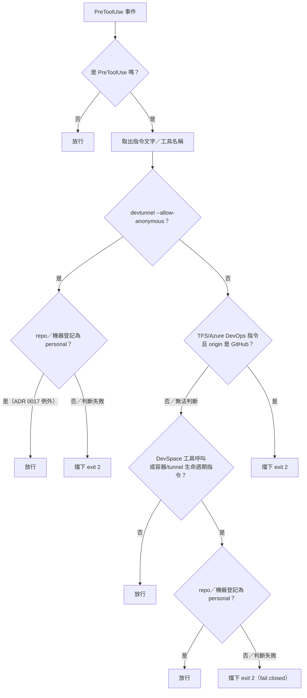

# Governance Command Policy Hook

## Problem

`vault/governance/operating-model.md` 的 L1 安全層有三條規則目前完全依賴 LLM 自律遵守，
沒有機制真的會擋下違規操作：

1. 禁止匿名公開 Tunnel（如 `devtunnel --allow-anonymous`）
2. Repository hosting boundary——`projectD-*` repo 必須走 GitHub remote，不得誤用
   F25B TFS/Azure DevOps 工作流程指令
3. DevSpace MCP 只能在個人專案使用，工作專案禁止——且判斷依據不能用 git remote host
   （個人與工作專案未來都可能在 GitHub 上，host 無法長期區分）

既有的 `scripts/governance-host-operation-hook.ps1` 是 critical 等級、有 SHA256 完整性
校驗的稽核帳本（見 `evals/governance-assets.json` 的
`tool-governance-host-operation-hook` 項目），其 `source_sink_policy` 明確宣告不檢視
原始工具輸入內容——這是刻意的設計邊界，不能承載「讀內容做比對」的邏輯。三條規則因此由
一支新的獨立 hook 承載，不修改既有稽核 hook。

## Outcome

新增 `scripts/governance-command-policy-hook.ps1`，在 PreToolUse 階段檢視 Bash/
PowerShell 指令內容與 MCP 工具名稱，命中三條規則任一時擋下該次工具呼叫
（exit code 2）並給出明確拒絕原因，讓 AI agent 能立即自行調整，不必等人事後糾正。

## 決策流程



規則 1、2 的「否／無法判斷」都導向放行（fail open）；規則 1 的 personal 例外判斷、
規則 3 的 personal 判斷，失敗時都導向擋下（fail closed）——這兩種方向並存，不是
單一例外處理邏輯，見 [governance-command-policy-hook.ps1](../../scripts/governance-command-policy-hook.ps1)
檔頭註解的完整說明。

## User stories

1. As a projectD-core 維護者，I want 匿名公開 tunnel 指令在執行前被擋下，so that 不會
   有疏忽造成的暴露面。
2. As an AI agent，I want 誤用 TFS 指令時立刻收到明確拒絕訊息，so that 我能自行改用正確
   工作流程。
3. As a projectD-core 維護者，I want 工作專案裡呼叫 DevSpace MCP 一律被擋下，且不受
   repo 未來搬到哪個 git host 影響，so that 資安邊界長期穩定。

## Acceptance criteria

- [ ] 匿名 tunnel：指令含 `devtunnel` + `--allow-anonymous`/`-allow-anonymous`（不分
      大小寫）→ 擋下，exit 2。
- [ ] TFS 誤用：指令符合 `tf checkin/checkout/get/merge/shelve`、`az repos`、
      `az boards`、或含 `dev.azure.com`/`visualstudio.com` 網址，且
      `git remote get-url origin` 確認為 GitHub → 擋下；無法判斷 origin → **fail
      open，放行**。
- [ ] DevSpace 邊界：工具名稱符合 DevSpace MCP 樣式（如 `mcp__devspace__*`），且目前
      repo 的 remote URL 雜湊在登記檔裡查得的分類**不是** `"personal"`（含未登記、
      查無登記檔、`PROJECTD_CORE` 未設定、檔案讀取/解析失敗等任何不確定情況）→
      **一律擋下**，exit 2。這條的不確定性處理跟前兩條相反：**fail closed**。
- [ ] 登記檔固定放在 `vault/governance/project-classification.json`（版控可見，不在
      `.local/` 底下），使不同機器 clone 同一個 projectD-core 就能取得相同登記結果。
- [ ] 非 Bash/PowerShell、非 DevSpace MCP 的工具呼叫完全不受影響，直接放行。
- [ ] Hook 自身發生非預期例外時：規則 1、2 fail open；規則 3（DevSpace）fail
      closed。不得讓單一例外處理邏輯套用到全部三條規則。
- [ ] 拒絕訊息具體且可讀（中文），說明命中哪條規則、建議怎麼改；不落地寫入任何檔案。
- [ ] `.claude/settings.json` 與 `.codex/hooks.json` 的 PreToolUse 陣列各自新增這支
      hook 的獨立項目，與既有稽核 hook 並存。
- [ ] 登記檔內容只含 remote URL 的 SHA-256 雜湊當 key，不含明文路徑、repo 名稱或
      remote URL——即使進 public repo 版控也不外流可辨識資訊。
- [ ] 提供一個登記用的小工具（同一支腳本的參數模式，或獨立小腳本），輸入目前 repo，
      輸出/寫入正規化後的雜湊值，使用者不必手算 SHA-256。

## Implementation decisions

- 新檔名：`scripts/governance-command-policy-hook.ps1`，獨立於
  `governance-host-operation-hook.ps1`，互不呼叫，不修改既有檔案。
- 只註冊 PreToolUse。
- 規則 1、2：讀 `tool_input.command`/`tool_input.script`；TFS 判斷需要
  `git -C <ProjectRoot> remote get-url origin`，失敗一律 fail open（新元件的 bug
  不該讓整個 session 沒辦法跑 shell 指令，代價不對稱）。
- 規則 3：
  - 登記檔路徑：`<projectD-core>/vault/governance/project-classification.json`
    （`PROJECTD_CORE` 環境變數或既有 Fleet wiring 解析目前 repo 的位置，沿用
    `core/skills/manage-requirement-knowledge` 已建立的解析慣例）。**刻意不放在
    `.local/` 底下**——`.local` 在這個 repo 的既有語意是「純本機、一律不進版控」
    （`knowledge-workspaces.json` 即是此例），為單一檔案開 gitignore 例外會混淆這個
    語意；此檔案本來就只含雜湊值、已確認安全公開，直接放版控可見路徑即可跨機器同步，
    不需要任何 gitignore 例外規則。
  - Key 計算：對目前 repo 的 `origin` remote URL 做 normalize（轉小寫、移除
    `user:token@` 形式的內嵌帳密、移除結尾 `.git` 與斜線），再算 SHA-256，格式
    `sha256:<64 hex>`。
  - Schema：
    ```json
    {
      "schema_version": 1,
      "repositories": { "sha256:<64 hex>": "personal" },
      "default": "work"
    }
    ```
  - 查表結果只有明確等於 `"personal"` 才放行；其餘一律視為需要擋下（fail closed）——
    誤放行 DevSpace 在工作專案上是真實資安風險（對應
    `docs/adr/0015-isolate-ai-agent-mcp-server-execution.md` 的事件背景），代價遠高於
    「暫時不能用，手動登記一筆就解決」。
  - 登記工具：`scripts/governance-command-policy-hook.ps1 -RegisterCurrentRepo personal`
    （或獨立子指令）算出目前 repo 的雜湊、寫入登記檔，避免手動計算出錯。
- 兩種 fail 方向並存於同一支腳本，分別由各自規則的例外處理區塊實作，不共用單一
  try/catch 決定全部行為。

## Testing decisions

- 比照 `scripts/governance-host-trial-eval.ps1` 手法：固定 JSON payload 餵 stdin，
  斷言 exit code 與 stderr。
- 案例至少涵蓋：
  - 三條規則各自的命中/不命中
  - TFS 規則 git 指令失敗時 fail open
  - DevSpace 規則：登記檔缺失、未登記該 repo、`PROJECTD_CORE` 未設定、JSON 格式錯誤，
    皆 fail closed
  - 已登記為 `"personal"` 的 repo 呼叫 DevSpace MCP 時放行
  - 非 Bash/PowerShell/DevSpace 工具直接放行
  - remote URL 內嵌帳密時，normalize 後雜湊仍與不含帳密的版本一致
- 本次先不登記進 `evals/governance-assets.json`（需另開至少一個正式 eval case 才符合
  該 schema 的 `related_eval_cases` 必填要求，工作量獨立於本次，留待下一輪）。

## Out of scope

- 不修改 `governance-host-operation-hook.ps1`。
- 不處理「Allowlist 掃描邊界」規則（誤擋風險高，另外評估）。
- 不偵測 `devtunnel` 之外的其他 tunnel 工具。
- SSH 形式的 remote URL（`git@host:org/repo.git`）normalize 規則本次先只處理 HTTPS
  形式；SSH 形式列為已知限制，不在本次驗收範圍。
- 登記檔以外的維護介面（不做互動式 CLI 或 UI，只有單一登記指令）。
- 不做 PostToolUse 階段的稽核或事後記錄。

## Assumptions and open questions

- 假設登記檔要進版控才算「跨機器同步」；由於內容只有雜湊值，判斷可安全公開。若之後
  發現雜湊本身在特定情境下仍可能被字典攻擊反推（例如 remote URL 高度可猜測），需要
  重新評估是否要加鹽——本次先不加鹽，因為 salt 也需要跨機器同步，否則同一 repo 在不同
  機器算出不同雜湊，違背「跨機器同步」的原始目的。
- SSH remote URL 的 normalize 規則未定案，留待實作時依實際遇到的格式決定，或明確標記
  為已知限制。

## Addendum: machine-level classification (post-implementation)

實作完成後追加的延伸：判斷 DevSpace 邊界時，新增**機器層級**分類作為 repo 層級的
fallback——「這台電腦整體算個人/工作」，不必每個 repo 都個別登記。

- 登記檔新增 `machines` 欄位，key 一樣是 SHA-256 雜湊，這次雜湊輸入是
  `[Environment]::MachineName`（正規化為小寫）——理由與 repo remote URL 相同：
  電腦名稱常帶公司命名慣例，不能在 public repo 存明文。
- 判斷順序：**repo 層級登記優先於機器層級**；兩者都沒登記才 fail closed 擋下。
  未登記（不論哪一層）預設一律視為工作區——與原始設計的 fail-closed 方向一致，
  不是新規則。
- 新增 `-RegisterCurrentMachine` 登記模式（`-RegisterCurrentRepo` 與
  `-RegisterCurrentMachine` 二擇一，不可同時使用）。
- 目前這台電腦（`OLIVER-3F-4-PC`）已登記為 `personal`。

## Addendum: DevSpace lifecycle commands, not just MCP tool calls
（post-implementation）

實際把 `containers/devspace-isolation/` 接起來後發現：規則 3 原本只比對工具名稱是
否符合 `mcp__devspace__*`，但 DevSpace 實際上是靠純 Bash/PowerShell 指令啟動的
（`docker compose up` 對著 `containers/devspace-isolation/`、`cloudflared tunnel`
指向其固定的 7676 port）——這些指令從頭到尾不會經過任何 `mcp__devspace__*` 工具
呼叫，代表原始規則 3 完全擋不住「直接用 Bash 把 DevSpace 容器/tunnel 啟動起來」
這件事。

修正：新增 `Test-DevSpaceLifecycleCommand`，比對指令文字裡是否出現這個框架獨有
的識別字串（`devspace-isolation`、`devspace-isolated`、`devspace-port-forward`、
`devspace-egress-proxy`，或 `cloudflared tunnel` 搭配固定 port `7676`）。命中時
套用跟原本規則 3 完全相同的 fail-closed 判斷（未登記 personal 就擋）。工具名稱
判斷與指令文字判斷現在是 `or` 關係，任一命中都算 DevSpace 呼叫。

## References

- `vault/governance/operating-model.md`（L1 安全層，行 57-64 Repository hosting
  boundary、行 66-77 匿名 Tunnel 禁令與 AI-agent MCP server 執行邊界）
- `docs/adr/0015-isolate-ai-agent-mcp-server-execution.md`（DevSpace MCP 隔離背景）
- `evals/governance-assets.json`（既有稽核 hook 的受控資產登記，`source_sink_policy`
  原文）
- `scripts/governance-host-operation-hook.ps1`（既有稽核 hook 實作，本提案刻意不修改；
  `Get-PrivateSlug`/`Get-JsonElementSha256` 是雜湊化識別資訊的既有先例）
- `core/skills/manage-requirement-knowledge/SKILL.md`（`PROJECTD_CORE` 解析慣例）

## Addendum: 資安複查發現的繞過與修法（post-implementation）

PR 送出後做正式資安複查（`security-review` skill），實測(不是只讀 regex)發現三個
真實可繞過的漏洞，已修正並補迴歸測試：

1. **匿名 tunnel 規則被官方替代寫法繞過**：原本 regex 只認完整字串
   `--allow-anonymous`，但 `devtunnel` 官方短旗標 `-a` 與 `devtunnel access
   create ... --anonymous`（無 `allow-` 前綴）都能達到一樣效果，而且是這個
   repo 自己 README 教的實際指令。修法：regex 改成同時涵蓋三種寫法。
2. **DevSpace 生命週期偵測完全不認得 `devtunnel`**：原本只認 `cloudflared
   tunnel`，但 README 最後採用的是 Microsoft Dev Tunnel——`devtunnel create/
   port create/access create/host` 四行實際指令沒有一行會被認出來。修法：
   補上 `devtunnel` 相關樣式與固定 tunnel 名稱 `devspace-projectd`。
3. **修法本身一開始有 false positive**：只要指令文字裡任何地方出現
   `devtunnel` 字樣（例如純粹的註解或 echo），搭配同一行任何地方不相干的
   `-a`，就會誤判。修法：改成先用 `;`/`&&`/`||`/`|`/換行切段，同一段裡才比對，
   不跨指令邊界判斷。

## Addendum: 登記指令要求真正互動式終端機（post-implementation，威脅模型決定）

第 3 項發現（`-RegisterCurrentRepo`/`-RegisterCurrentMachine` 登記指令本身不受
任何規則管制，理論上能被誤導的 agent session 自我升級成 personal）原本標記
「刻意先不修」，待威脅模型範圍定案——後續確認：這整套 hook 存在的理由本來就是
「agent 可能被誤導去做不該做的事」，不是單純防手滑，登記指令這個入口不管，跟
rule 1、rule 3 的設計精神不一致，因此決定修。

修法：登記動作要求真正互動式終端機才能執行，用 `[Console]::IsInputRedirected`
判斷——AI agent 透過 Bash/PowerShell 工具呼叫的指令一律是 stdin 被重新導向
（非互動），會被拒絕；使用者自己在真正的終端機視窗貼上同一行指令則不受影響。
已用真實環境驗證：透過 Bash 呼叫 `-RegisterCurrentMachine` 正確回報「登記只能
在真正的互動式終端機裡執行」並以 exit code 1 結束。

**仍未解決的部分**：直接編輯 `vault/governance/project-classification.json`
本身沒有任何完整性保護（不是唯讀、沒有雜湊釘選），這個修法沒有處理——任何有
檔案寫入權限的操作都還是能直接改登記檔內容。這是不同層面的問題（檔案完整性
vs. 指令執行管道），留待另外評估是否需要處理。

## Addendum: 資安複查已知未修項目補修（post-implementation）

上一輪複查記錄的「已知、明確標記未修」項目中，以下三項這次補上（第四項——
`egress-proxy` 無法完整 `cap_drop: ALL`——使用者確認先不處理，維持原本的已知
限制記錄，見 `docs/specs/devspace-isolation-container-framework.md` 該段落）：

1. **TFS 規則被完整路徑呼叫繞過**：`Test-TfsWorkflowViolation` 原本的 regex
   是 `(^|[;&|]\s*)tf(\.exe)?\s+...`，只認「指令一開始就是 tf」或「接在
   `;`/`&`/`|` 之後」的 `tf`；但實際測試發現 `C:\tools\tf.exe checkin` 這種
   完整路徑呼叫完全不會命中（`\` 不在錨點清單裡）。修法：改成 `\btf(\.exe)?
   \s+...`，用單字邊界取代錨點——`\b` 本身就足以避免誤判成其他單字的子字串
   （因為後面仍要求接空白與已知子指令），同時涵蓋完整路徑呼叫。已補迴歸測試
   （完整路徑 `tf.exe checkin`，GitHub remote 時應被擋）。
2. **登記檔本身沒有完整性保護，直接補上**：上一輪標記為「不同層面問題，留待
   另外評估」的登記檔完整性缺口，這次直接處理（範圍限定在能被此 hook 攔截的
   操作，不是完整的檔案系統存取控制）。新增 `Test-RegistryTamperViolation`：
   - 結構化的檔案編輯工具（Edit/Write/NotebookEdit）若 target path 解析後
     等於登記檔的絕對路徑，直接擋下。
   - Bash/PowerShell 指令文字裡若同時出現登記檔檔名與常見寫入/重導向指標
     （`>`、`Set-Content`、`Add-Content`、`Out-File`、`cp`/`copy`/`mv`/
     `move`、`sed -i`、`ConvertTo-Json ... |` 等），也擋下。
   - 判斷失敗（例外）時 fail **closed**（擋下），比照規則 3 的安全等級，不是
     規則 1/2 的 fail-open 語意——因為這是登記檔本身的完整性邊界，寧可誤擋也
     不要誤放。
   - **仍未涵蓋的繞過路徑**（跟本檔案其他規則一樣，屬於文字/參數比對的既有
     限制，不是新引入的缺口）：把檔名塞進變數再組出指令、逐位元組寫入、透過
     包一層 wrapper script 間接寫入等，仍可能繞過純文字比對。若之後要更完整
     防護，需要在檔案系統層做唯讀掛載或雜湊簽章驗證，這次不做。
   - 已補四個迴歸測試：Edit 工具直接改登記檔（擋）、Bash 指令帶寫入指標改
     登記檔（擋）、單純讀取登記檔（不擋）、編輯無關檔案（不擋）。
3. **`egress-proxy` 的 squid 允許清單缺少內網位址阻擋**：見
   `docs/specs/devspace-isolation-container-framework.md` 對應段落（改動的是
   `squid.conf`，記在容器框架 spec 裡比較貼近實作位置）。

以上三項均已用真實執行結果驗證（不只是讀 regex/程式碼），並重跑完整 pytest
套件（8 個測試）確認無回歸。
