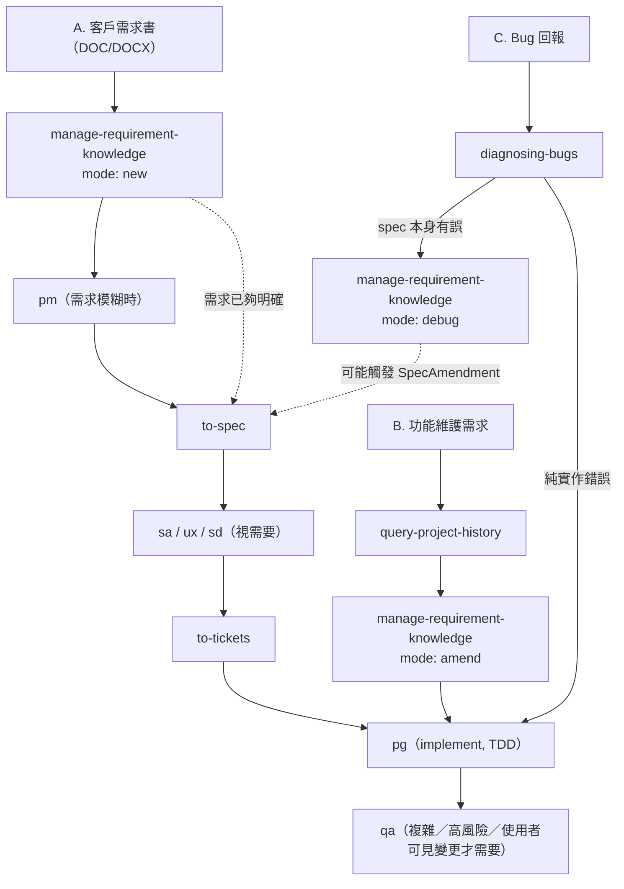

# 需求驅動開發路由

> 本檔是 L3 流程層在「需求書開發／功能維護／debug」三個常見情境下的具體路由範例，
> 搭配常見例外狀況的對照。角色與 Skill 定義本身不重複列在此檔；不清楚時回
> `operating-model.md` L3 或 `INDEX.md`。

## 三條主線總覽



三條線共用同一組角色與 Skill，差別只在起點（需求書 vs 既有系統 vs bug）跟要不要
動正式 spec；`manage-requirement-knowledge` 的 `new`/`amend`/`debug` 三個 mode
是同一支 Skill，不是三套機制。

## 三條主線

### A. 客戶提出需求書 → 開發新功能

```
需求書（DOC/DOCX）
  → manage-requirement-knowledge（mode: new）  把需求正式收錄進 KnowledgeWorkspace
  → pm                                         需求模糊、範圍不清時才介入澄清
  → to-spec                                    整合成可審查的 Spec/PRD
  → sa / ux / sd（視需要）                      技術影響、互動流程、架構取捨不清楚才用
  → to-tickets                                 拆成可獨立驗收的 tracer-bullet ticket
  → pg（implement skill，TDD：Red → Green → Refactor）
  → qa（複雜、高風險或使用者可見變更才需要）
```

對應 L3「大型」路由；需求書本身已足夠明確、範圍夠小時，可直接從 `to-spec` 甚至 `pg`
開始，不必逐層跑完。

### B. 功能維護

```
維護需求
  → query-project-history                      先查既有決策脈絡，避免推翻既有取捨
  → manage-requirement-knowledge（mode: amend） 正式規格有變更時，更新 ConfirmedSpec
  → pg（implement skill）                       多數維護屬中型任務，SA/PG 短計畫即可
```

多數落在 L3「中型」路由；牽動架構或跨模組影響時才升級走 PM→SA→UX→SD。

### C. Debug

```
bug 回報
  → diagnosing-bugs                             根因分析，先建立最小重現
  ├─ 純實作錯誤 → pg 直接 TDD 修復（Red 用能重現 bug 的測試）
  └─ 根因顯示原始 spec 有誤／需正式變更
       → manage-requirement-knowledge（mode: debug）  產出 DebugRecord，可能觸發 SpecAmendment
```

三個 mode（`new`/`amend`/`debug`）已內建在同一個 Skill，debug 走到需要動 spec 時直接
切換 mode，不另開機制。

## 常見例外狀況對照

三條主線是理想路徑；實際開發常見以下狀況會打斷或改變路徑，均已有對應機制，不需要
另建流程：

### 需求書本身有問題

- **模糊／前後矛盾**：`pm` 澄清可能要來回多輪，不是一次成功；核心是釐清「客戶說的
  what」與「客戶真正要的 why」。
- **只給畫面／截圖，沒講邏輯規則**：卡在 `to-spec` 前，先補齊隱含假設，不直接動工。
- **多份需求文件互相衝突**：先解衝突，不能直接進 `to-spec`。

### 開發中途才發現的狀況

- **技術不可行**：已核准的 spec 做到一半發現做不到，退回 `sa`/`sd` 重新評估，不能
  硬做。
- **範圍蔓延（scope creep）**：非原始需求內的變更走 `MaterialProposal`
  （`operating-model.md` TaskScopedProposalLoop 的 Propose 階段），先提案取得授權，
  不默默塞進同一個 ticket。
- **驗收標準認知不一致**：通常是 `to-spec` 階段驗收條件寫得不夠具體，回頭補齊，不在
  `pg`/`qa` 階段各自解讀。

### 緊急／插隊狀況

- **Production 事故，沒空走完整流程**：先修復、事後用 `manage-requirement-knowledge`
  的 `debug` mode 補 DebugRecord，不強制修復前先走完整需求流程。
- **舊功能維護撞上新功能開發**：同一模組被兩條需求同時動時，先確認彼此改動路徑互斥
  （見 `operating-model.md` 平行／背景 Agent 派工一節），單人開發時也要手動檢查，不
  能假設不會衝突。

### Debug 特有的複雜狀況

- **無法穩定重現**（race condition、環境相關、間歇性）：連續失敗兩次即停止修補、回
  到最小重現，不無限期亂試（見 L2 判斷層）。
- **根因在外部系統／第三方依賴**：留證據說明「非本次變更造成」，不背這個鍋，也不貿
  然去改外部系統。

### 舊系統／技術債限制

- **沒有測試基礎設施的 legacy 程式碼**：TDD 優先流程退化為特徵測試或人工驗證，不強
  行導入整套測試框架（見 L3 TDD 優先流程）。
- **既有慣例跟 pack 建議衝突**：選型優先權「專案既有依賴／慣例 > 技術棧 adapter」，
  不因想用新做法打掉既有慣例（見 L4 能力選型與技術生態路由）。

## 維護

只有實際踩坑、路由本身證明不適用，或新增常見例外情境時才修改本檔；不為單一任務的
特例擴充成通用規則。
